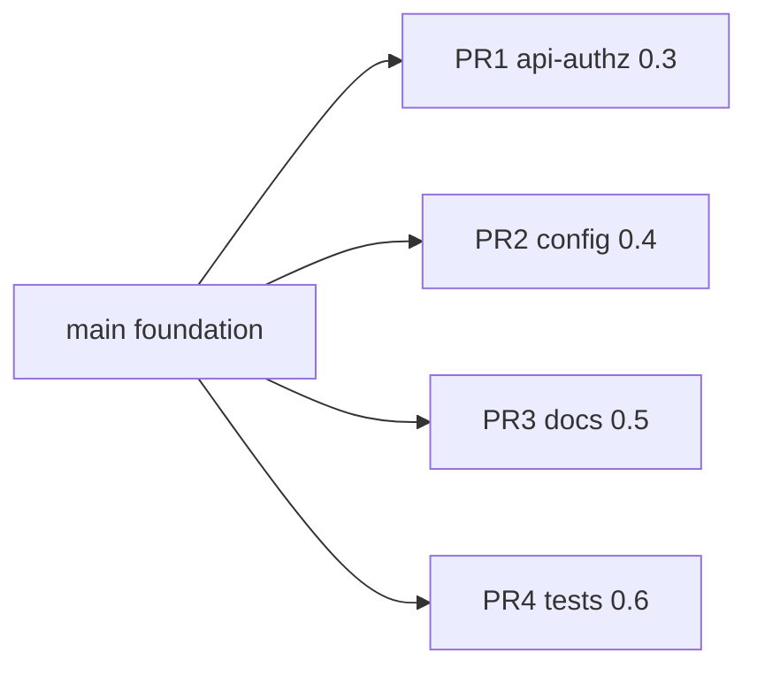

# Split-to-PRs draft

**Status:** Foundation committed to `main`. PR 1–4 below are **PRD Phase 0** implementation branches (post-foundation).

**Removed:** ~~PR1 Agent skills~~ — landed in foundation commit.

## Foundation (on `main`)

Single commit includes:

- Matt Pocock skills install + `docs/agents/*` config
- Buyer sign-in + operator nav gating
- Market model sales analytics
- `PLAN.md`, reference rubrics, PRD, split draft
- GitHub issue + PR templates, triage labels

## Post-foundation PRs (PRD Phase 0)

Four independent branches off `main`, one sub-agent each:

| PR | Branch | Sub-agent | PLAN task | Title |
|----|--------|-----------|-----------|-------|
| **1** | `feat/phase-0-3-profile-batch` | `api-authz` | 0.3 | Require profile_id on scheduled batch run |
| **2** | `feat/phase-0-4-prod-secrets` | `config-hardening` | 0.4 | Reject change-me secrets in production |
| **3** | `docs/phase-0-5-auth-wiki` | `docs-security` | 0.5 | Document buyer vs operator auth in wiki |
| **4** | `test/phase-0-6-authz` | `test-authz` | 0.6 | Authz tests for profile-scoped APIs |

**Deferred:** notebook hygiene (not in Phase 0).

See [`application-buildout-prd.md`](application-buildout-prd.md) for acceptance criteria.
